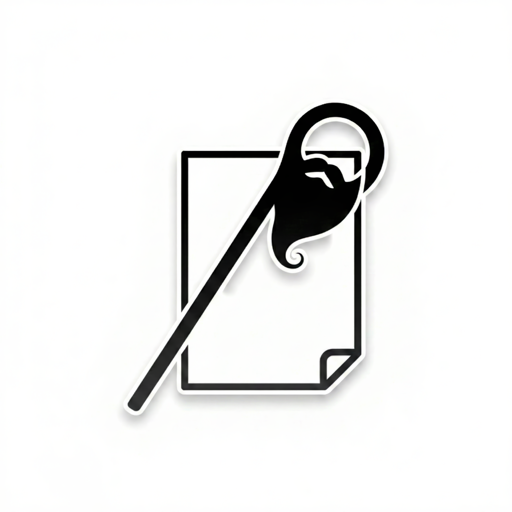

# Geras : PDF Compressor

Geras is a native macOS PDF compressor built with SwiftUI. It bundles QPDF (lossless cleanup) and Ghostscript (lossy compression + optional rasterization) so end users can just download and run the app without installing anything.

## Features
- Clean Up (lossless): reorganizes and re-compresses PDF internals without changing visual quality.
- Make Smaller (lossy): down-samples images for major size reduction while keeping text selectable.
- Flatten to Images: renders every page to an image for maximum size control (text becomes non-selectable).

## Build
### Requirements
- macOS 12+
- Xcode 15+
- XcodeGen (`brew install xcodegen`)
- Homebrew (only if you need to refresh bundled tools)

### Steps
1. Generate the Xcode project:
   
   ```bash
   xcodegen generate
   ```

2. If you need to refresh bundled tools (maintainers only):
   
   ```bash
   scripts/vendor_qpdf.sh
   scripts/vendor_ghostscript.sh
   ```

3. Open `Geras.xcodeproj` and build.

The build process copies the bundled tools into the app at:
`Geras PDF Compressor.app/Contents/Resources/`

## Distribution
Releases are shipped as a ready-to-run `.app` bundle. Users do **not** need Homebrew or any terminal steps.

## Licensing
This project is licensed under the **GNU Affero General Public License v3.0**. See `LICENSE`.

Bundled third‑party components and their licenses are included in `Resources/Licenses/`:
- QPDF (Apache‑2.0) + NOTICE
- Ghostscript (AGPL‑3.0) + additional licensing notes

If you distribute this app, you must comply with AGPL requirements and include all third‑party notices.

## Repository
This repo is intended for: `Al-Battashi/Geras.git`.
